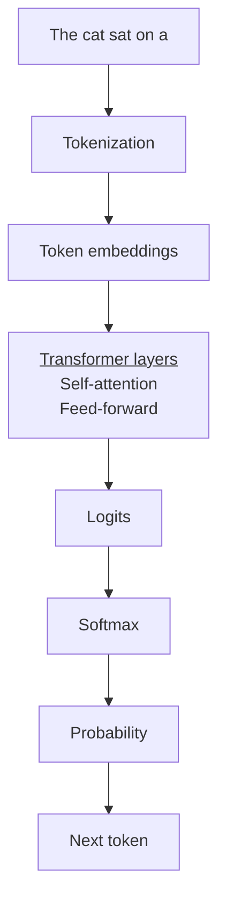

## Tokens
Tokens are the fundamental units of text that the LLM reads and generates. They are also used to calculate the billing and cost. When a user sends the text query, the tokenizer is responsible to convert the text into tokens. In English language, the token is usually of 4 characters but may depend on the model/tokenizer. For example, common words like apple may remain apple even though it's 5 characters.

e.g.

User query: What's the forecast for today?

Tokens: `[what] ['] [s] [ the] [ fore] [cast] [ for] [ today] [?]`

The tokenization may vary from model to model. A model made especially for gaming may keep `[ggwp]` as one token because it's quite common word and will appear frequently in both user text and LLM result.

In the below example, you can check how the tokenizer of your model breaks your input into tokens for the model. Notice how the spaces converted to underscores. Model decides how to tokenize the text.

```python
from dotenv import load_dotenv

# Loading HF_TOKEN.
load_dotenv()

from transformers import AutoTokenizer

def get_tokens(text: str):
	model_id = "google/gemma-4-E4B"
	tokenizer = AutoTokenizer.from_pretrained(model_id);
	tokens = tokenizer.tokenize(text);

	print(f"Raw tokens: {tokens}\n")

user_input = "what's the weather like for today?"
get_tokens(user_input)

user_input = "whats the weather like for today?"
get_tokens(user_input)

user_input = "hehe, ggwp"
get_tokens(user_input)

# Output
Raw tokens: ['what', "'", 's', '▁the', '▁weather', '▁like', '▁for', '▁today', '?']
Raw tokens: ['whats', '▁the', '▁weather', '▁like', '▁for', '▁today', '?']
Raw tokens: ['hehe', ',', '_gg', 'wp']
```


## Context Window
Context window is the maximum number of tokens the model can process in a single request. It may include predefined instructions, conversation history, previously generated output, tools results, documented submitted alongside the original user input.

Why does it matter?
It matters because it acts as memory for the AI. The more, the better. But it can backfire as well due to hallucinations.

In below example, we try to see how the system can compile input/output from various source to
create a context. In this example, we use a jinja file to see how the context looks like. This doesn't dive into the topics such as context management. Various chat application manage context length differently. Some may summarize the user chat history to reduce the size. Some may remove inputs by how outdated they are.

```python
from ollama import chat, ChatResponse
from transformers import AutoTokenizer
from typing import TypedDict, Literal
from dotenv import load_dotenv

""" HF token. """
load_dotenv()

""" Strict typing for the messages to llm. """
class Message(TypedDict):
	role: Literal['system', 'user', 'assistant', 'tool']
	content: str

""" Get token information using native ollama module. """
def info_using_ollama(messages: list[Message]):
	response: ChatResponse = chat(
		model='gemma4:e4b',
		messages=messages
	)

	print(f'The total number of tokens used for prompt: {response['prompt_eval_count']}\n')

def info_using_hf(messages: list[Message]):
	model_id = "google/gemma-4-E4B-it"
	tokenizer = AutoTokenizer.from_pretrained(model_id)

	"""
		google/gemma-4-E4B didn't have a jinja template on hf, so used google/gemma-4-E4B-it's
		jinja file. Noticed jinja template is responsible for converting the all the messages/contexts
		into single text to be processed. Upon researching, llms can be without jinja file and handle
		the messages at the chat or orchestration level.
	"""
	# with open("chat_templates/gemma-4-E4B-it/chat_template.jinja", "r") as file:
	# tokenizer.chat_template = file.read()

	prompt = tokenizer.apply_chat_template(messages, tokenize=False, add_generation_prompt=True)
	tokens = tokenizer.tokenize(prompt)
	token_count = len(tokens)

	print(f"Raw tokens: {tokens}\n")
	print(f'The total number of tokens used for prompt: {token_count}\n')

messages: list[Message] = [
	{'role': 'system', 'content': 'You joke about the user input.'},
	{'role': 'user', 'content': 'Explain content window in LLMs'}
]

info_using_ollama(messages)
info_using_hf(messages)
```

## Temperature
Temperature is a setting that controls how random or varied the model's output is. It changes how strongly the model favours the most probable next tokens.

- Low Temperature (~0–0.3): more predictable and consistent.
- Medium Temperature (~ 0.5–0.8): balance between consistency and variety.
- High (~1+): more varied and surprising.

Temperature is directly proportional to set of next probable tokens. We need to understand a few jargons to understand how temperature works. We will consider "The cat sat on a " as an input to the model and see how the next token is predicted.
1. Logit: The transformer processes all the previous tokens and produces a number called logit for every possible token in its vocabulary. Think of it as weightage for each possible token. So, let's consider the few tokens in the vocabulary look like mat(5.0), chair(2.0), floor(3.5), ocean(0.0) etc. _`(token(logit))`_
2. Temperature: Before Softmax formula is applied, temperature is used in the formula to manipulate the logits. A high temperature can distribute the probability homogeneously to all the tokens, hence, giving model more option to produce the next token, A lower temperature will reduce the size of next token candidates.
3. Softmax: The logits is converted into probabilities using Softmax. Basically, saying what's the probability of next token to generate a good output. So, let's consider after using softmax formula, we get mat(0.76), chair(0.05), floor(0.21), ocean(0.00) etc. _`(token(probability))



Temperature is only controlling the probability of tokens to become next tokens, if more tokens become significant due to higher temperature, the model will have large pool of tokens to choose from and vice-versa. This is why, for factual data, a lower temperature is applied and for creative content, a higher temperature is suggested.

NOTE: the chat can also opt to ignore the temperature in certain cases depending on how it is programmed to handle those cases. On gemma4, the chat choose to answer, `mat`, when prompt was `The cat sat on a `. So I had to ask a uncommon question.

```python
import ollama

response = ollama.chat(
	model="gemma4:e4b",
	messages=[{"role": "user", "content": "What would life be without oxygen tank?"}],
	options={
		"temperature": 0.11,
	},
)

print(f'The output with lower temperature (0.11): \n{response["message"]["content"]}\n')

response = ollama.chat(
	model="gemma4:e4b",
	messages=[{"role": "user", "content": "What would life be without oxygen tank?"}],
	options={
		"temperature": 0.99,
	},
)

print(f'The output with higher temperature (0.99): \n{response["message"]["content"]}\n')

"""
Output:
The output with lower temperature (0.11): 
This question can be interpreted in two ways:

1. **The Literal Interpretation:** What would life be like without the *technology* of oxygen tanks (the portable delivery system)?
2. **The Fundamental Interpretation:** What would life be like without *oxygen* ($\text{O}_2$) itself?

Given the profound nature of the topic, the answer must address the fundamental necessity of the gas. **If we assume you are asking about life without oxygen itself, the answer is that complex life, as we know it, could not exist.**

Here is a detailed breakdown of the consequences, addressing both the biological and planetary impacts.

---

## 🔬 The Fundamental Collapse (Without Oxygen)

Oxygen is not merely a gas; it is the primary energy source for **aerobic respiration**, the metabolic process that powers nearly all complexlife forms, including humans.

### 1. The Biological Impact (The Body)

When oxygen is removed from the atmosphere, the body immediately enters a state of **hypoxia** (low oxygen levels).

*   **Energy Failure:** Our cells rely on oxygen to act as the final electron acceptor in the electron transport chain. This process generates **ATP (Adenosine Triphosphate)**, the universal energy currency of the cell. Without oxygen, ATP production grinds to a halt.
*   **The Switch to Anaerobic Respiration:** The body attempts to compensate by switching to anaerobic respiration (like the process that occurs in muscle cells during intense exercise). This process is inefficient and toxic. Instead of generating massive amounts of energy, it produces **lactic acid**.
*   **Acidosis and Failure:** The rapid buildup of lactic acid causes severe metabolic acidosis. This acidity disrupts the delicate chemical balance of the blood, leading to organ failure.
*   **Timeline:**
    *   **Minutes:** Confusion, dizziness, rapid breathing, and loss of coordination.
    *   **Hours:** Severe organ damage, particularly to the brain and heart.
    *   **Days:** Death.

### 2. The Planetary Impact (The Ecosystem)

The loss of oxygen would not just affect humans; it would cause a global ecological collapse.

*   **The Source:** The oxygen in our atmosphere is maintained by **photosynthesis**, the process carried out by plants, algae, and cyanobacteria. These organisms convert sunlight, water, and carbon dioxide into glucose and oxygen.
*   **The Cycle:** Oxygen and carbon dioxide are locked in a continuous cycle. If the oxygen source fails (e.g., if all photosynthetic life died), the atmosphere would quickly become depleted of $\text{O}_2$.
*   **The Shift to Anaerobic Life:** Life would not vanish entirely, but it would be drastically limited. The planet would revert to an **anaerobic state**, meaning life would be restricted to organisms that do not require oxygen. These include certain types of bacteria and archaea that thrive in oxygen-free environments, such as deep-sea hydrothermal vents or deep within the Earth's crust.
*   **The Atmosphere:** The air would become a mix of nitrogen, carbon dioxide, and other gases, but the breathable, life-sustaining component would be gone.

---

## ⚙️ The Technological Interpretation (Without the Tank)

If the question is interpreted as "What if we lost the *technology* of supplemental oxygen tanks, but the atmosphere remained breathable?" the impact would be limited to specific populations.

*   **For the General Population:** Life would continue normally. The atmosphere is the source; the tank is merely a temporary, supplemental delivery method.
*   **For Dependent Individuals:** People who rely on supplemental oxygen (such as those with severe COPD, emphysema, or certain sleep disorders) would face immediate, life-threatening crises. For them, the loss of the tank means the loss of their primary life support system.

---

## 💡 Summary Table

| Aspect | With Oxygen ($\text{O}_2$) | Without Oxygen ($\text{O}_2$) |
| :--- | :--- | :--- |
| **Energy Source** | Aerobic Respiration (High ATP) | Anaerobic Respiration (Low ATP) |
| **Waste Product** | Carbon Dioxide ($\text{CO}_2$) | Lactic Acid |
| **Biological State** | Stable, high energy, complex life | Acidosis, organ failure, limited to simple life |
| **Ecosystem** | Photosynthesis sustains the cycle | Collapse; limited to anaerobic bacteria |
| **Survival** | Sustainable (as long as the source exists) | Impossible for complex life |

The output with higher temperature (0.99): 
***Disclaimer: I am an AI, not a medical professional. If you or someone else is currently relying on supplemental oxygen, you must follow the instructions of your healthcare provider and emergency services immediately. The following is a theoretical discussion of the consequences of oxygen deficiency.***

The answer depends heavily on whether you mean "without a single, portable oxygen tank" (a temporary, personal crisis) or "without the element of oxygen in our atmosphere" (a catastrophic global event).

Here is a breakdown of what life would be like in both scenarios.

---

## 💨 Scenario 1: Losing a Portable Oxygen Tank (Personal Crisis)

If a person who relies on supplemental oxygen loses their tank, the immediate consequences are related to **hypoxia**—a state where the body’s tissues are not receiving enough oxygen.

The body is highly efficient at detecting drops in blood oxygen levels, and the symptoms would progress rapidly:

### ⚠️ Immediate Physical Effects (Symptoms)

1.  **Difficulty Breathing (Dyspnea):** The person would feel extreme shortness of breath, panic, and a desperate urge to inhale deeply.
2.  **Dizziness and Lightheadedness:** The brain, which requires a constant, high supply of oxygen, is the first organ to show signs of distress.
3.  **Confusion and Impaired Judgment:** Cognitive functions slow down. The individual may become disoriented, confused, or unable to think clearly.
4.  **Increased Heart Rate and Breathing Rate:** The body’s instinctive response is to try and "catch up" on oxygen by pumping blood faster and breathing harder.
5.  **Loss of Consciousness:** If the oxygen deficit is severe enough and prolonged, the person will pass out (syncope) due to cerebral hypoxia.

### ⚕️ Impact on Healthcare Systems

If we imagine a scenario where portable oxygen resources vanish entirely, the medical consequences would be devastating:

*   **Hospital Care:** Patients with chronic obstructive pulmonary disease (COPD), severe asthma, or heart failure would become acutely unstable.
*   **Surgery:** Many surgeries require supplemental oxygen for recovery, making complex procedures impossible or extremely dangerous.
*   **Mortality Rates:** The death rate for millions of chronic respiratory patients would spike dramatically, placing an overwhelming burdenon first responders and hospitals.

---

## 🌎 Scenario 2: Losing Oxygen in the Atmosphere (Global Catastrophe)

If oxygen were to suddenly become unavailable in our atmosphere, the consequences would be instantaneous, absolute, and unsurvivable for nearly all complex life forms.

Oxygen ($\text{O}_2$) is not merely a gas that we breathe; it is the chemical foundation for the energy processes that sustain life on Earth.

### 1. Biological Impact (The Breathing Aspect)

*   **Immediate Collapse:** All aerobic life (animals, most plants, humans) would cease function. Breathing is impossible without the element.
*   **Energy Crisis:** Cellular respiration is the process where organisms use oxygen to break down nutrients (like glucose) and release energy (ATP). Without $\text{O}_2$, this process stops, and the body starves of energy within minutes.
*   **Exception:** Only anaerobic life forms (like some types of deep-sea bacteria) could survive the initial loss, but these are not the dominant forms of complex life.

### 2. Industrial and Energy Impact (The Functioning Aspect)

Oxygen is a fundamental component of energy transfer and industry. Its loss would shut down virtually every technological process:

*   **Combustion:** Modern engines (cars, planes, power plants) rely on burning fuel with oxygen. Without it, the entire global power grid grinds to an immediate halt.
*   **Welding and Cutting:** These critical construction and repair methods rely entirely on oxygen to superheat materials. Infrastructure maintenance becomes impossible.
*   **Deep Sea Diving:** SCUBA tanks rely on bottled oxygen (or specialized gas mixes). Without it, deep-sea exploration and rescue operations are terminated.

### 3. The Ecosystem Impact (The Supporting Aspect)

*   **Fire and Heat:** Even simple processes like controlled fires require oxygen. The ability to manage fire (and the threat of it) would vanish.
*   **Photosynthesis:** While plants also produce oxygen, they are fundamentally reliant on sunlight and water. However, oxygen is so centralto the entire biosphere that its loss breaks the feedback loop that sustains life.

---

## Summary Comparison

| Element | Scenario | What is Lost? | Consequences |
| :--- | :--- | :--- | :--- |
| **Oxygen Tank** | **Personal Loss** | A temporary, localized source of high-concentration gas. | Hypoxia, disorientation, immediate medicalcrisis. Fatal if prolonged. |
| **Atmosphere** | **Global Loss** | The fundamental element required for cellular respiration, combustion, and energy transfer. | Immediate and catastrophic collapse of all complex life and civilization. |
"""
```


## Related Topics
- [[]]